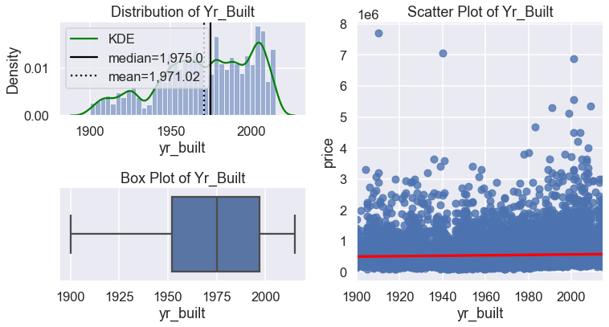
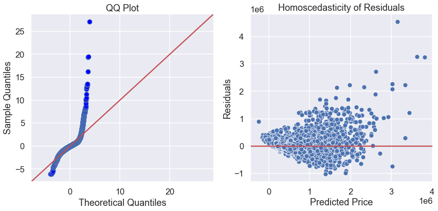

# Final Project Submission

* Student name: Jonathan Lee
* Student pace: full time
* Scheduled project review date/time: April 27, 2pm
* Instructor name: James Irving

## TABLE OF CONTENTS 

*Click to jump to matching Markdown Header.*  

    
- **[Introduction](#INTRODUCTION) **
- **[OBTAIN](#OBTAIN)** 
- **[SCRUB](#SCRUB)** 
- **[EXPLORE](#EXPLORE)** 
- **[MODEL](#MODEL)** 
- **[iNTERPRET](#iNTERPRET)** 
- **[Conclusions/Recommendations](#CONCLUSIONS-&-RECOMMENDATIONS) **

___

# INTRODUCTION

This analysis focuses on creating a multiple regression model based on housing data from King County, Washington. We will work through an exploratory data analysis to clean the data that we have to prepare it for modeling, as well as working through an iterative approach to refining our model. The goal of this analysis is to create a model which explains how different attributes affect the value of a housing property in King County, and to extract specific variables which we can use to recommend to a homeowner in King County how to increase the value of his/her home. 

# OBTAIN

The data that we will use in this analysis has been provided as a .csv file. We will inspect the data types to determine how to approach the cleansing process.

    <class 'pandas.core.frame.DataFrame'>
    RangeIndex: 21597 entries, 0 to 21596
    Data columns (total 21 columns):
     #   Column         Non-Null Count  Dtype  
    ---  ------         --------------  -----  
     0   id             21597 non-null  int64  
     1   date           21597 non-null  object 
     2   price          21597 non-null  float64
     3   bedrooms       21597 non-null  int64  
     4   bathrooms      21597 non-null  float64
     5   sqft_living    21597 non-null  int64  
     6   sqft_lot       21597 non-null  int64  
     7   floors         21597 non-null  float64
     8   waterfront     19221 non-null  float64
     9   view           21534 non-null  float64
     10  condition      21597 non-null  int64  
     11  grade          21597 non-null  int64  
     12  sqft_above     21597 non-null  int64  
     13  sqft_basement  21597 non-null  object 
     14  yr_built       21597 non-null  int64  
     15  yr_renovated   17755 non-null  float64
     16  zipcode        21597 non-null  int64  
     17  lat            21597 non-null  float64
     18  long           21597 non-null  float64
     19  sqft_living15  21597 non-null  int64  
     20  sqft_lot15     21597 non-null  int64  
    dtypes: float64(8), int64(11), object(2)
    memory usage: 3.5+ MB

<table border="1" class="dataframe">
  <thead>
    <tr style="text-align: right;">
      <th></th>
      <th>id</th>
      <th>date</th>
      <th>price</th>
      <th>bedrooms</th>
      <th>bathrooms</th>
      <th>sqft_living</th>
      <th>sqft_lot</th>
      <th>floors</th>
      <th>waterfront</th>
      <th>view</th>
      <th>...</th>
      <th>grade</th>
      <th>sqft_above</th>
      <th>sqft_basement</th>
      <th>yr_built</th>
      <th>yr_renovated</th>
      <th>zipcode</th>
      <th>lat</th>
      <th>long</th>
      <th>sqft_living15</th>
      <th>sqft_lot15</th>
    </tr>
  </thead>
  <tbody>
    <tr>
      <th>0</th>
      <td>7129300520</td>
      <td>10/13/2014</td>
      <td>221900.0</td>
      <td>3</td>
      <td>1.00</td>
      <td>1180</td>
      <td>5650</td>
      <td>1.0</td>
      <td>NaN</td>
      <td>0.0</td>
      <td>...</td>
      <td>7</td>
      <td>1180</td>
      <td>0.0</td>
      <td>1955</td>
      <td>0.0</td>
      <td>98178</td>
      <td>47.5112</td>
      <td>-122.257</td>
      <td>1340</td>
      <td>5650</td>
    </tr>
    <tr>
      <th>1</th>
      <td>6414100192</td>
      <td>12/9/2014</td>
      <td>538000.0</td>
      <td>3</td>
      <td>2.25</td>
      <td>2570</td>
      <td>7242</td>
      <td>2.0</td>
      <td>0.0</td>
      <td>0.0</td>
      <td>...</td>
      <td>7</td>
      <td>2170</td>
      <td>400.0</td>
      <td>1951</td>
      <td>1991.0</td>
      <td>98125</td>
      <td>47.7210</td>
      <td>-122.319</td>
      <td>1690</td>
      <td>7639</td>
    </tr>
    <tr>
      <th>2</th>
      <td>5631500400</td>
      <td>2/25/2015</td>
      <td>180000.0</td>
      <td>2</td>
      <td>1.00</td>
      <td>770</td>
      <td>10000</td>
      <td>1.0</td>
      <td>0.0</td>
      <td>0.0</td>
      <td>...</td>
      <td>6</td>
      <td>770</td>
      <td>0.0</td>
      <td>1933</td>
      <td>NaN</td>
      <td>98028</td>
      <td>47.7379</td>
      <td>-122.233</td>
      <td>2720</td>
      <td>8062</td>
    </tr>
    <tr>
      <th>3</th>
      <td>2487200875</td>
      <td>12/9/2014</td>
      <td>604000.0</td>
      <td>4</td>
      <td>3.00</td>
      <td>1960</td>
      <td>5000</td>
      <td>1.0</td>
      <td>0.0</td>
      <td>0.0</td>
      <td>...</td>
      <td>7</td>
      <td>1050</td>
      <td>910.0</td>
      <td>1965</td>
      <td>0.0</td>
      <td>98136</td>
      <td>47.5208</td>
      <td>-122.393</td>
      <td>1360</td>
      <td>5000</td>
    </tr>
    <tr>
      <th>4</th>
      <td>1954400510</td>
      <td>2/18/2015</td>
      <td>510000.0</td>
      <td>3</td>
      <td>2.00</td>
      <td>1680</td>
      <td>8080</td>
      <td>1.0</td>
      <td>0.0</td>
      <td>0.0</td>
      <td>...</td>
      <td>8</td>
      <td>1680</td>
      <td>0.0</td>
      <td>1987</td>
      <td>0.0</td>
      <td>98074</td>
      <td>47.6168</td>
      <td>-122.045</td>
      <td>1800</td>
      <td>7503</td>
    </tr>
  </tbody>
</table>

5 rows × 21 columns

# SCRUB

The data looks clean for the most part, but there are null values in the columns labeled 'waterfront', 'view' and 'yr_renovated' which will be addressed in this section. We also need to make sure to address the two columns that have been stored as object data types labeled 'date' and 'sqft_basement' in addition to checking for duplicated entries. 

## Feature Engineering
Because those properties that have not been renovated contain a value of 0.0 under their 'yr_renovated' column, this will skew the rest of the data where the other entries that have been renovated will contain a year number. We will engineer a binary feature that indicates whether or not the property has undergone any renovation in order to avoid this skew issue.

## Checking for Correlation and Multicollinearity

We will move on to check for how correlated each column is with our target variable 'price' as well as check for multicollinearity

    

    

    

    

From the correlation heatmap, we can see that other than 'sqft_living', we do not have any variables that are high enough to remove prior to running our baseline model. We will go ahead and remove 'sqft_living' to address the issue of multicollinearity in our dataset.

    

    

# EXPLORE

In this section, we will explore the distributions as well as addressing the issue of outliers in each column. We will also be checking to see how much of a linear relationship each variable has with our target variable 'price'.

## Checking for Normality, Outliers, and Linearity

There appear to be some outliers, as in the case of bedrooms where the max number is 33. Although this might be an error in data collection, we will leave the outliers be for now to see how they affect the skew of our data and how our baseline model turns out with what has been provided.

We will proceed to visualize how our data is distributed as well as the linearity of each variable against the price variable.

    

    

    

    

    

    

    

    

    

    

    

    

    

    

    

    

    

    

    

    

    

    

    

    

    

    

    

    

    

    

    

    

    

    

## One Hot Encoding

We can see that there are some categorical variables in our dataset, but other than the 'zipcode' column, the other variables are ordinal.

We will proceed to use One Hot Encoding prior to running our multiple regression model including the zipcode data.

# MODEL

Finally, we have prepared our data enough to be able to run an initial iteration of our multiple regression model! As we create each model, we will include a QQ plot to address the normality of residuals as well as plotting price vs residuals in order to check for homoscedasticity of residuals.

## Creating a Baseline Model

<table class="simpletable">
<caption>OLS Regression Results</caption>
<tr>
  <th>Dep. Variable:</th>          <td>price</td>      <th>  R-squared:         </th>  <td>   0.793</td>  
</tr>
<tr>
  <th>Model:</th>                   <td>OLS</td>       <th>  Adj. R-squared:    </th>  <td>   0.792</td>  
</tr>
<tr>
  <th>Method:</th>             <td>Least Squares</td>  <th>  F-statistic:       </th>  <td>   1006.</td>  
</tr>
<tr>
  <th>Date:</th>             <td>Fri, 16 Apr 2021</td> <th>  Prob (F-statistic):</th>   <td>  0.00</td>   
</tr>
<tr>
  <th>Time:</th>                 <td>21:51:04</td>     <th>  Log-Likelihood:    </th> <td>-2.8434e+05</td>
</tr>
<tr>
  <th>No. Observations:</th>      <td> 21143</td>      <th>  AIC:               </th>  <td>5.689e+05</td> 
</tr>
<tr>
  <th>Df Residuals:</th>          <td> 21062</td>      <th>  BIC:               </th>  <td>5.695e+05</td> 
</tr>
<tr>
  <th>Df Model:</th>              <td>    80</td>      <th>                     </th>      <td> </td>     
</tr>
<tr>
  <th>Covariance Type:</th>      <td>nonrobust</td>    <th>                     </th>      <td> </td>     
</tr>
</table>
<table class="simpletable">
<tr>
        <td></td>           <th>coef</th>     <th>std err</th>      <th>t</th>      <th>P>|t|</th>  <th>[0.025</th>    <th>0.975]</th>  
</tr>
<tr>
  <th>Intercept</th>     <td>-2.693e+07</td> <td> 6.51e+06</td> <td>   -4.140</td> <td> 0.000</td> <td>-3.97e+07</td> <td>-1.42e+07</td>
</tr>
<tr>
  <th>bedrooms</th>      <td>-2.781e+04</td> <td> 1614.774</td> <td>  -17.224</td> <td> 0.000</td> <td> -3.1e+04</td> <td>-2.46e+04</td>
</tr>
<tr>
  <th>bathrooms</th>     <td>  1.29e+04</td> <td> 2621.916</td> <td>    4.920</td> <td> 0.000</td> <td> 7760.985</td> <td>  1.8e+04</td>
</tr>
<tr>
  <th>sqft_lot</th>      <td>    0.2365</td> <td>    0.031</td> <td>    7.642</td> <td> 0.000</td> <td>    0.176</td> <td>    0.297</td>
</tr>
<tr>
  <th>floors</th>        <td>-6.476e+04</td> <td> 3127.358</td> <td>  -20.708</td> <td> 0.000</td> <td>-7.09e+04</td> <td>-5.86e+04</td>
</tr>
<tr>
  <th>waterfront</th>    <td> 8.813e+05</td> <td> 1.46e+04</td> <td>   60.424</td> <td> 0.000</td> <td> 8.53e+05</td> <td>  9.1e+05</td>
</tr>
<tr>
  <th>grade</th>         <td> 5.264e+04</td> <td> 1832.891</td> <td>   28.717</td> <td> 0.000</td> <td>  4.9e+04</td> <td> 5.62e+04</td>
</tr>
<tr>
  <th>sqft_above</th>    <td>  219.3557</td> <td>    3.115</td> <td>   70.429</td> <td> 0.000</td> <td>  213.251</td> <td>  225.460</td>
</tr>
<tr>
  <th>sqft_basement</th> <td>  157.4838</td> <td>    3.686</td> <td>   42.720</td> <td> 0.000</td> <td>  150.258</td> <td>  164.709</td>
</tr>
<tr>
  <th>lat</th>           <td> 1.207e+05</td> <td> 6.69e+04</td> <td>    1.804</td> <td> 0.071</td> <td>-1.04e+04</td> <td> 2.52e+05</td>
</tr>
<tr>
  <th>long</th>          <td>-1.703e+05</td> <td> 4.83e+04</td> <td>   -3.523</td> <td> 0.000</td> <td>-2.65e+05</td> <td>-7.55e+04</td>
</tr>
<tr>
  <th>sqft_living15</th> <td>   27.4453</td> <td>    2.985</td> <td>    9.193</td> <td> 0.000</td> <td>   21.594</td> <td>   33.297</td>
</tr>
<tr>
  <th>zipcode_98002</th> <td> 5.715e+04</td> <td> 1.52e+04</td> <td>    3.760</td> <td> 0.000</td> <td> 2.74e+04</td> <td> 8.69e+04</td>
</tr>
<tr>
  <th>zipcode_98003</th> <td>-1.635e+04</td> <td> 1.37e+04</td> <td>   -1.195</td> <td> 0.232</td> <td>-4.32e+04</td> <td> 1.05e+04</td>
</tr>
<tr>
  <th>zipcode_98004</th> <td> 7.574e+05</td> <td> 2.47e+04</td> <td>   30.600</td> <td> 0.000</td> <td> 7.09e+05</td> <td> 8.06e+05</td>
</tr>
<tr>
  <th>zipcode_98005</th> <td> 2.806e+05</td> <td> 2.64e+04</td> <td>   10.614</td> <td> 0.000</td> <td> 2.29e+05</td> <td> 3.32e+05</td>
</tr>
<tr>
  <th>zipcode_98006</th> <td> 2.751e+05</td> <td> 2.16e+04</td> <td>   12.709</td> <td> 0.000</td> <td> 2.33e+05</td> <td> 3.18e+05</td>
</tr>
<tr>
  <th>zipcode_98007</th> <td> 2.345e+05</td> <td> 2.73e+04</td> <td>    8.586</td> <td> 0.000</td> <td> 1.81e+05</td> <td> 2.88e+05</td>
</tr>
<tr>
  <th>zipcode_98008</th> <td> 2.612e+05</td> <td>  2.6e+04</td> <td>   10.058</td> <td> 0.000</td> <td>  2.1e+05</td> <td> 3.12e+05</td>
</tr>
<tr>
  <th>zipcode_98010</th> <td> 1.146e+05</td> <td> 2.33e+04</td> <td>    4.917</td> <td> 0.000</td> <td> 6.89e+04</td> <td>  1.6e+05</td>
</tr>
<tr>
  <th>zipcode_98011</th> <td> 6.726e+04</td> <td> 3.38e+04</td> <td>    1.991</td> <td> 0.047</td> <td> 1034.942</td> <td> 1.33e+05</td>
</tr>
<tr>
  <th>zipcode_98014</th> <td> 1.215e+05</td> <td> 3.71e+04</td> <td>    3.277</td> <td> 0.001</td> <td> 4.88e+04</td> <td> 1.94e+05</td>
</tr>
<tr>
  <th>zipcode_98019</th> <td> 7.459e+04</td> <td> 3.67e+04</td> <td>    2.034</td> <td> 0.042</td> <td> 2728.027</td> <td> 1.46e+05</td>
</tr>
<tr>
  <th>zipcode_98022</th> <td> 8.621e+04</td> <td> 2.03e+04</td> <td>    4.253</td> <td> 0.000</td> <td> 4.65e+04</td> <td> 1.26e+05</td>
</tr>
<tr>
  <th>zipcode_98023</th> <td>-5.151e+04</td> <td> 1.26e+04</td> <td>   -4.093</td> <td> 0.000</td> <td>-7.62e+04</td> <td>-2.68e+04</td>
</tr>
<tr>
  <th>zipcode_98024</th> <td> 1.806e+05</td> <td> 3.27e+04</td> <td>    5.524</td> <td> 0.000</td> <td> 1.17e+05</td> <td> 2.45e+05</td>
</tr>
<tr>
  <th>zipcode_98027</th> <td> 1.718e+05</td> <td> 2.23e+04</td> <td>    7.706</td> <td> 0.000</td> <td> 1.28e+05</td> <td> 2.16e+05</td>
</tr>
<tr>
  <th>zipcode_98028</th> <td> 6.885e+04</td> <td> 3.28e+04</td> <td>    2.097</td> <td> 0.036</td> <td> 4507.689</td> <td> 1.33e+05</td>
</tr>
<tr>
  <th>zipcode_98029</th> <td> 2.212e+05</td> <td> 2.55e+04</td> <td>    8.683</td> <td> 0.000</td> <td> 1.71e+05</td> <td> 2.71e+05</td>
</tr>
<tr>
  <th>zipcode_98030</th> <td> 6440.1953</td> <td>  1.5e+04</td> <td>    0.428</td> <td> 0.669</td> <td>-2.31e+04</td> <td> 3.59e+04</td>
</tr>
<tr>
  <th>zipcode_98031</th> <td> 1.687e+04</td> <td> 1.57e+04</td> <td>    1.076</td> <td> 0.282</td> <td>-1.39e+04</td> <td> 4.76e+04</td>
</tr>
<tr>
  <th>zipcode_98032</th> <td> 9181.2935</td> <td> 1.81e+04</td> <td>    0.507</td> <td> 0.612</td> <td>-2.63e+04</td> <td> 4.47e+04</td>
</tr>
<tr>
  <th>zipcode_98033</th> <td>  3.43e+05</td> <td> 2.81e+04</td> <td>   12.190</td> <td> 0.000</td> <td> 2.88e+05</td> <td> 3.98e+05</td>
</tr>
<tr>
  <th>zipcode_98034</th> <td> 1.685e+05</td> <td> 3.02e+04</td> <td>    5.583</td> <td> 0.000</td> <td> 1.09e+05</td> <td> 2.28e+05</td>
</tr>
<tr>
  <th>zipcode_98038</th> <td> 5.275e+04</td> <td> 1.69e+04</td> <td>    3.115</td> <td> 0.002</td> <td> 1.96e+04</td> <td> 8.59e+04</td>
</tr>
<tr>
  <th>zipcode_98039</th> <td> 1.275e+06</td> <td> 3.35e+04</td> <td>   38.079</td> <td> 0.000</td> <td> 1.21e+06</td> <td> 1.34e+06</td>
</tr>
<tr>
  <th>zipcode_98040</th> <td> 5.198e+05</td> <td> 2.19e+04</td> <td>   23.764</td> <td> 0.000</td> <td> 4.77e+05</td> <td> 5.63e+05</td>
</tr>
<tr>
  <th>zipcode_98042</th> <td> 2.321e+04</td> <td> 1.44e+04</td> <td>    1.615</td> <td> 0.106</td> <td>-4962.935</td> <td> 5.14e+04</td>
</tr>
<tr>
  <th>zipcode_98045</th> <td> 1.575e+05</td> <td> 3.13e+04</td> <td>    5.039</td> <td> 0.000</td> <td> 9.62e+04</td> <td> 2.19e+05</td>
</tr>
<tr>
  <th>zipcode_98052</th> <td> 1.962e+05</td> <td> 2.88e+04</td> <td>    6.825</td> <td> 0.000</td> <td>  1.4e+05</td> <td> 2.53e+05</td>
</tr>
<tr>
  <th>zipcode_98053</th> <td> 1.611e+05</td> <td> 3.08e+04</td> <td>    5.224</td> <td> 0.000</td> <td> 1.01e+05</td> <td> 2.21e+05</td>
</tr>
<tr>
  <th>zipcode_98055</th> <td> 4.754e+04</td> <td> 1.74e+04</td> <td>    2.729</td> <td> 0.006</td> <td> 1.34e+04</td> <td> 8.17e+04</td>
</tr>
<tr>
  <th>zipcode_98056</th> <td> 9.953e+04</td> <td> 1.89e+04</td> <td>    5.274</td> <td> 0.000</td> <td> 6.25e+04</td> <td> 1.37e+05</td>
</tr>
<tr>
  <th>zipcode_98058</th> <td> 3.033e+04</td> <td> 1.65e+04</td> <td>    1.841</td> <td> 0.066</td> <td>-1957.843</td> <td> 6.26e+04</td>
</tr>
<tr>
  <th>zipcode_98059</th> <td> 7.367e+04</td> <td> 1.86e+04</td> <td>    3.969</td> <td> 0.000</td> <td> 3.73e+04</td> <td>  1.1e+05</td>
</tr>
<tr>
  <th>zipcode_98065</th> <td>  1.18e+05</td> <td> 2.88e+04</td> <td>    4.098</td> <td> 0.000</td> <td> 6.15e+04</td> <td> 1.74e+05</td>
</tr>
<tr>
  <th>zipcode_98070</th> <td> -1.88e+04</td> <td> 2.17e+04</td> <td>   -0.867</td> <td> 0.386</td> <td>-6.13e+04</td> <td> 2.37e+04</td>
</tr>
<tr>
  <th>zipcode_98072</th> <td> 1.063e+05</td> <td> 3.36e+04</td> <td>    3.160</td> <td> 0.002</td> <td> 4.03e+04</td> <td> 1.72e+05</td>
</tr>
<tr>
  <th>zipcode_98074</th> <td> 1.576e+05</td> <td> 2.72e+04</td> <td>    5.785</td> <td> 0.000</td> <td> 1.04e+05</td> <td> 2.11e+05</td>
</tr>
<tr>
  <th>zipcode_98075</th> <td> 1.604e+05</td> <td> 2.62e+04</td> <td>    6.116</td> <td> 0.000</td> <td> 1.09e+05</td> <td> 2.12e+05</td>
</tr>
<tr>
  <th>zipcode_98077</th> <td> 7.644e+04</td> <td>  3.5e+04</td> <td>    2.185</td> <td> 0.029</td> <td> 7873.688</td> <td> 1.45e+05</td>
</tr>
<tr>
  <th>zipcode_98092</th> <td>-2.541e+04</td> <td> 1.37e+04</td> <td>   -1.855</td> <td> 0.064</td> <td>-5.23e+04</td> <td> 1439.737</td>
</tr>
<tr>
  <th>zipcode_98102</th> <td> 5.076e+05</td> <td>  2.9e+04</td> <td>   17.532</td> <td> 0.000</td> <td> 4.51e+05</td> <td> 5.64e+05</td>
</tr>
<tr>
  <th>zipcode_98103</th> <td> 3.306e+05</td> <td> 2.71e+04</td> <td>   12.201</td> <td> 0.000</td> <td> 2.78e+05</td> <td> 3.84e+05</td>
</tr>
<tr>
  <th>zipcode_98105</th> <td>  4.71e+05</td> <td> 2.78e+04</td> <td>   16.967</td> <td> 0.000</td> <td> 4.17e+05</td> <td> 5.25e+05</td>
</tr>
<tr>
  <th>zipcode_98106</th> <td> 1.245e+05</td> <td> 2.02e+04</td> <td>    6.177</td> <td> 0.000</td> <td>  8.5e+04</td> <td> 1.64e+05</td>
</tr>
<tr>
  <th>zipcode_98107</th> <td> 3.323e+05</td> <td>  2.8e+04</td> <td>   11.882</td> <td> 0.000</td> <td> 2.77e+05</td> <td> 3.87e+05</td>
</tr>
<tr>
  <th>zipcode_98108</th> <td> 1.132e+05</td> <td> 2.22e+04</td> <td>    5.099</td> <td> 0.000</td> <td> 6.97e+04</td> <td> 1.57e+05</td>
</tr>
<tr>
  <th>zipcode_98109</th> <td>  4.99e+05</td> <td> 2.88e+04</td> <td>   17.319</td> <td> 0.000</td> <td> 4.43e+05</td> <td> 5.55e+05</td>
</tr>
<tr>
  <th>zipcode_98112</th> <td> 6.152e+05</td> <td> 2.55e+04</td> <td>   24.168</td> <td> 0.000</td> <td> 5.65e+05</td> <td> 6.65e+05</td>
</tr>
<tr>
  <th>zipcode_98115</th> <td> 3.155e+05</td> <td> 2.76e+04</td> <td>   11.436</td> <td> 0.000</td> <td> 2.61e+05</td> <td>  3.7e+05</td>
</tr>
<tr>
  <th>zipcode_98116</th> <td> 3.002e+05</td> <td> 2.24e+04</td> <td>   13.379</td> <td> 0.000</td> <td> 2.56e+05</td> <td> 3.44e+05</td>
</tr>
<tr>
  <th>zipcode_98117</th> <td> 2.948e+05</td> <td> 2.79e+04</td> <td>   10.552</td> <td> 0.000</td> <td>  2.4e+05</td> <td>  3.5e+05</td>
</tr>
<tr>
  <th>zipcode_98118</th> <td> 1.769e+05</td> <td> 1.96e+04</td> <td>    9.036</td> <td> 0.000</td> <td> 1.39e+05</td> <td> 2.15e+05</td>
</tr>
<tr>
  <th>zipcode_98119</th> <td> 4.967e+05</td> <td> 2.72e+04</td> <td>   18.259</td> <td> 0.000</td> <td> 4.43e+05</td> <td>  5.5e+05</td>
</tr>
<tr>
  <th>zipcode_98122</th> <td> 3.457e+05</td> <td> 2.42e+04</td> <td>   14.279</td> <td> 0.000</td> <td> 2.98e+05</td> <td> 3.93e+05</td>
</tr>
<tr>
  <th>zipcode_98125</th> <td> 1.726e+05</td> <td> 2.99e+04</td> <td>    5.780</td> <td> 0.000</td> <td> 1.14e+05</td> <td> 2.31e+05</td>
</tr>
<tr>
  <th>zipcode_98126</th> <td> 1.959e+05</td> <td> 2.06e+04</td> <td>    9.494</td> <td> 0.000</td> <td> 1.55e+05</td> <td> 2.36e+05</td>
</tr>
<tr>
  <th>zipcode_98133</th> <td> 1.233e+05</td> <td> 3.09e+04</td> <td>    3.996</td> <td> 0.000</td> <td> 6.28e+04</td> <td> 1.84e+05</td>
</tr>
<tr>
  <th>zipcode_98136</th> <td> 2.492e+05</td> <td> 2.12e+04</td> <td>   11.770</td> <td> 0.000</td> <td> 2.08e+05</td> <td> 2.91e+05</td>
</tr>
<tr>
  <th>zipcode_98144</th> <td> 2.904e+05</td> <td> 2.25e+04</td> <td>   12.881</td> <td> 0.000</td> <td> 2.46e+05</td> <td> 3.35e+05</td>
</tr>
<tr>
  <th>zipcode_98146</th> <td> 1.078e+05</td> <td> 1.89e+04</td> <td>    5.692</td> <td> 0.000</td> <td> 7.07e+04</td> <td> 1.45e+05</td>
</tr>
<tr>
  <th>zipcode_98148</th> <td> 4.939e+04</td> <td> 2.59e+04</td> <td>    1.907</td> <td> 0.057</td> <td>-1381.603</td> <td>    1e+05</td>
</tr>
<tr>
  <th>zipcode_98155</th> <td> 1.051e+05</td> <td> 3.21e+04</td> <td>    3.275</td> <td> 0.001</td> <td> 4.22e+04</td> <td> 1.68e+05</td>
</tr>
<tr>
  <th>zipcode_98166</th> <td> 6.379e+04</td> <td> 1.73e+04</td> <td>    3.687</td> <td> 0.000</td> <td> 2.99e+04</td> <td> 9.77e+04</td>
</tr>
<tr>
  <th>zipcode_98168</th> <td> 6.116e+04</td> <td> 1.83e+04</td> <td>    3.341</td> <td> 0.001</td> <td> 2.53e+04</td> <td>  9.7e+04</td>
</tr>
<tr>
  <th>zipcode_98177</th> <td> 1.959e+05</td> <td> 3.22e+04</td> <td>    6.090</td> <td> 0.000</td> <td> 1.33e+05</td> <td> 2.59e+05</td>
</tr>
<tr>
  <th>zipcode_98178</th> <td> 4.907e+04</td> <td> 1.89e+04</td> <td>    2.602</td> <td> 0.009</td> <td> 1.21e+04</td> <td>  8.6e+04</td>
</tr>
<tr>
  <th>zipcode_98188</th> <td> 3.065e+04</td> <td> 1.95e+04</td> <td>    1.571</td> <td> 0.116</td> <td>-7588.055</td> <td> 6.89e+04</td>
</tr>
<tr>
  <th>zipcode_98198</th> <td> 1.591e+04</td> <td> 1.47e+04</td> <td>    1.079</td> <td> 0.281</td> <td> -1.3e+04</td> <td> 4.48e+04</td>
</tr>
<tr>
  <th>zipcode_98199</th> <td> 3.709e+05</td> <td> 2.65e+04</td> <td>   13.987</td> <td> 0.000</td> <td> 3.19e+05</td> <td> 4.23e+05</td>
</tr>
</table>
<table class="simpletable">
<tr>
  <th>Omnibus:</th>       <td>20092.654</td> <th>  Durbin-Watson:     </th>  <td>   1.985</td>  
</tr>
<tr>
  <th>Prob(Omnibus):</th>  <td> 0.000</td>   <th>  Jarque-Bera (JB):  </th> <td>3585946.415</td>
</tr>
<tr>
  <th>Skew:</th>           <td> 4.107</td>   <th>  Prob(JB):          </th>  <td>    0.00</td>  
</tr>
<tr>
  <th>Kurtosis:</th>       <td>66.270</td>   <th>  Cond. No.          </th>  <td>2.47e+08</td>  
</tr>
</table>  Notes: [1] Standard Errors assume that the covariance matrix of the errors is correctly specified. [2] The condition number is large, 2.47e+08. This might indicate that there are strong multicollinearity or other numerical problems.

    

    

## Removing Outliers to Fulfill Assumptions of Multiple Regressions

We have successfully run our baseline model, and our R2 value isn't too bad! However, we can see from the QQ plot and homoscedasticity plot that we are not fulfilling the assumptions of multiple regression. 

We will try to address this issue by removing outliers that lie 1.5 times the IQR below the first quartile and 1.5 times the IQR above the third quartile.

In the 'Explore' section, we saw that we have many outliers several columns. We will proceed to remove outliers from those columns that have extreme outliers, based on our boxplot visualizations.

<table class="simpletable">
<caption>OLS Regression Results</caption>
<tr>
  <th>Dep. Variable:</th>          <td>price</td>      <th>  R-squared:         </th>  <td>   0.807</td>  
</tr>
<tr>
  <th>Model:</th>                   <td>OLS</td>       <th>  Adj. R-squared:    </th>  <td>   0.806</td>  
</tr>
<tr>
  <th>Method:</th>             <td>Least Squares</td>  <th>  F-statistic:       </th>  <td>   848.1</td>  
</tr>
<tr>
  <th>Date:</th>             <td>Fri, 16 Apr 2021</td> <th>  Prob (F-statistic):</th>   <td>  0.00</td>   
</tr>
<tr>
  <th>Time:</th>                 <td>21:51:04</td>     <th>  Log-Likelihood:    </th> <td>-2.0856e+05</td>
</tr>
<tr>
  <th>No. Observations:</th>      <td> 16358</td>      <th>  AIC:               </th>  <td>4.173e+05</td> 
</tr>
<tr>
  <th>Df Residuals:</th>          <td> 16277</td>      <th>  BIC:               </th>  <td>4.179e+05</td> 
</tr>
<tr>
  <th>Df Model:</th>              <td>    80</td>      <th>                     </th>      <td> </td>     
</tr>
<tr>
  <th>Covariance Type:</th>      <td>nonrobust</td>    <th>                     </th>      <td> </td>     
</tr>
</table>
<table class="simpletable">
<tr>
        <td></td>           <th>coef</th>     <th>std err</th>      <th>t</th>      <th>P>|t|</th>  <th>[0.025</th>    <th>0.975]</th>  
</tr>
<tr>
  <th>Intercept</th>     <td>-2.098e+06</td> <td> 4.45e+06</td> <td>   -0.471</td> <td> 0.638</td> <td>-1.08e+07</td> <td> 6.63e+06</td>
</tr>
<tr>
  <th>bedrooms</th>      <td>-2850.0552</td> <td> 1115.288</td> <td>   -2.555</td> <td> 0.011</td> <td>-5036.141</td> <td> -663.969</td>
</tr>
<tr>
  <th>bathrooms</th>     <td> 6959.9481</td> <td> 1611.666</td> <td>    4.318</td> <td> 0.000</td> <td> 3800.906</td> <td> 1.01e+04</td>
</tr>
<tr>
  <th>sqft_lot</th>      <td>    2.8752</td> <td>    0.276</td> <td>   10.421</td> <td> 0.000</td> <td>    2.334</td> <td>    3.416</td>
</tr>
<tr>
  <th>floors</th>        <td> -2.75e+04</td> <td> 1951.375</td> <td>  -14.092</td> <td> 0.000</td> <td>-3.13e+04</td> <td>-2.37e+04</td>
</tr>
<tr>
  <th>waterfront</th>    <td> 3.382e+05</td> <td> 1.87e+04</td> <td>   18.087</td> <td> 0.000</td> <td> 3.02e+05</td> <td> 3.75e+05</td>
</tr>
<tr>
  <th>grade</th>         <td> 3.475e+04</td> <td> 1149.769</td> <td>   30.221</td> <td> 0.000</td> <td> 3.25e+04</td> <td>  3.7e+04</td>
</tr>
<tr>
  <th>sqft_above</th>    <td>  130.3372</td> <td>    2.348</td> <td>   55.502</td> <td> 0.000</td> <td>  125.734</td> <td>  134.940</td>
</tr>
<tr>
  <th>sqft_basement</th> <td>   90.9682</td> <td>    2.638</td> <td>   34.480</td> <td> 0.000</td> <td>   85.797</td> <td>   96.140</td>
</tr>
<tr>
  <th>lat</th>           <td>-4.173e+04</td> <td> 4.19e+04</td> <td>   -0.995</td> <td> 0.320</td> <td>-1.24e+05</td> <td> 4.05e+04</td>
</tr>
<tr>
  <th>long</th>          <td>-3.107e+04</td> <td> 3.37e+04</td> <td>   -0.922</td> <td> 0.356</td> <td>-9.71e+04</td> <td>  3.5e+04</td>
</tr>
<tr>
  <th>sqft_living15</th> <td>   34.8750</td> <td>    2.108</td> <td>   16.545</td> <td> 0.000</td> <td>   30.743</td> <td>   39.007</td>
</tr>
<tr>
  <th>zipcode_98002</th> <td> 3.279e+04</td> <td> 8193.908</td> <td>    4.001</td> <td> 0.000</td> <td> 1.67e+04</td> <td> 4.88e+04</td>
</tr>
<tr>
  <th>zipcode_98003</th> <td> 5708.5590</td> <td> 7433.852</td> <td>    0.768</td> <td> 0.443</td> <td>-8862.607</td> <td> 2.03e+04</td>
</tr>
<tr>
  <th>zipcode_98004</th> <td> 5.463e+05</td> <td> 1.58e+04</td> <td>   34.605</td> <td> 0.000</td> <td> 5.15e+05</td> <td> 5.77e+05</td>
</tr>
<tr>
  <th>zipcode_98005</th> <td> 3.521e+05</td> <td> 1.62e+04</td> <td>   21.728</td> <td> 0.000</td> <td>  3.2e+05</td> <td> 3.84e+05</td>
</tr>
<tr>
  <th>zipcode_98006</th> <td> 2.942e+05</td> <td> 1.34e+04</td> <td>   21.879</td> <td> 0.000</td> <td> 2.68e+05</td> <td> 3.21e+05</td>
</tr>
<tr>
  <th>zipcode_98007</th> <td> 2.793e+05</td> <td> 1.64e+04</td> <td>   17.022</td> <td> 0.000</td> <td> 2.47e+05</td> <td> 3.11e+05</td>
</tr>
<tr>
  <th>zipcode_98008</th> <td> 2.716e+05</td> <td> 1.59e+04</td> <td>   17.079</td> <td> 0.000</td> <td>  2.4e+05</td> <td> 3.03e+05</td>
</tr>
<tr>
  <th>zipcode_98010</th> <td> 1.052e+05</td> <td> 1.61e+04</td> <td>    6.535</td> <td> 0.000</td> <td> 7.37e+04</td> <td> 1.37e+05</td>
</tr>
<tr>
  <th>zipcode_98011</th> <td> 1.656e+05</td> <td> 2.06e+04</td> <td>    8.024</td> <td> 0.000</td> <td> 1.25e+05</td> <td> 2.06e+05</td>
</tr>
<tr>
  <th>zipcode_98014</th> <td>  1.37e+05</td> <td> 2.61e+04</td> <td>    5.255</td> <td> 0.000</td> <td> 8.59e+04</td> <td> 1.88e+05</td>
</tr>
<tr>
  <th>zipcode_98019</th> <td>  1.15e+05</td> <td> 2.29e+04</td> <td>    5.023</td> <td> 0.000</td> <td> 7.01e+04</td> <td>  1.6e+05</td>
</tr>
<tr>
  <th>zipcode_98022</th> <td> 3.168e+04</td> <td> 1.33e+04</td> <td>    2.382</td> <td> 0.017</td> <td> 5610.093</td> <td> 5.78e+04</td>
</tr>
<tr>
  <th>zipcode_98023</th> <td>-1.431e+04</td> <td> 7174.382</td> <td>   -1.995</td> <td> 0.046</td> <td>-2.84e+04</td> <td> -247.789</td>
</tr>
<tr>
  <th>zipcode_98024</th> <td> 1.662e+05</td> <td> 2.45e+04</td> <td>    6.796</td> <td> 0.000</td> <td> 1.18e+05</td> <td> 2.14e+05</td>
</tr>
<tr>
  <th>zipcode_98027</th> <td> 2.528e+05</td> <td> 1.46e+04</td> <td>   17.348</td> <td> 0.000</td> <td> 2.24e+05</td> <td> 2.81e+05</td>
</tr>
<tr>
  <th>zipcode_98028</th> <td> 1.532e+05</td> <td> 2.01e+04</td> <td>    7.620</td> <td> 0.000</td> <td> 1.14e+05</td> <td> 1.93e+05</td>
</tr>
<tr>
  <th>zipcode_98029</th> <td> 2.584e+05</td> <td>  1.6e+04</td> <td>   16.180</td> <td> 0.000</td> <td> 2.27e+05</td> <td>  2.9e+05</td>
</tr>
<tr>
  <th>zipcode_98030</th> <td> 1.107e+04</td> <td> 8322.238</td> <td>    1.330</td> <td> 0.184</td> <td>-5244.964</td> <td> 2.74e+04</td>
</tr>
<tr>
  <th>zipcode_98031</th> <td> 2.545e+04</td> <td> 8842.824</td> <td>    2.878</td> <td> 0.004</td> <td> 8117.202</td> <td> 4.28e+04</td>
</tr>
<tr>
  <th>zipcode_98032</th> <td> 1.577e+04</td> <td> 9774.747</td> <td>    1.614</td> <td> 0.107</td> <td>-3384.816</td> <td> 3.49e+04</td>
</tr>
<tr>
  <th>zipcode_98033</th> <td>  3.44e+05</td> <td> 1.74e+04</td> <td>   19.733</td> <td> 0.000</td> <td>  3.1e+05</td> <td> 3.78e+05</td>
</tr>
<tr>
  <th>zipcode_98034</th> <td> 2.116e+05</td> <td> 1.86e+04</td> <td>   11.375</td> <td> 0.000</td> <td> 1.75e+05</td> <td> 2.48e+05</td>
</tr>
<tr>
  <th>zipcode_98038</th> <td> 4.761e+04</td> <td> 1.05e+04</td> <td>    4.525</td> <td> 0.000</td> <td>  2.7e+04</td> <td> 6.82e+04</td>
</tr>
<tr>
  <th>zipcode_98039</th> <td> 6.678e+05</td> <td> 3.71e+04</td> <td>   18.020</td> <td> 0.000</td> <td> 5.95e+05</td> <td>  7.4e+05</td>
</tr>
<tr>
  <th>zipcode_98040</th> <td>  4.52e+05</td> <td> 1.42e+04</td> <td>   31.871</td> <td> 0.000</td> <td> 4.24e+05</td> <td>  4.8e+05</td>
</tr>
<tr>
  <th>zipcode_98042</th> <td> 2.367e+04</td> <td> 8705.330</td> <td>    2.719</td> <td> 0.007</td> <td> 6610.572</td> <td> 4.07e+04</td>
</tr>
<tr>
  <th>zipcode_98045</th> <td> 1.206e+05</td> <td> 2.06e+04</td> <td>    5.851</td> <td> 0.000</td> <td> 8.02e+04</td> <td> 1.61e+05</td>
</tr>
<tr>
  <th>zipcode_98052</th> <td> 2.762e+05</td> <td> 1.77e+04</td> <td>   15.598</td> <td> 0.000</td> <td> 2.41e+05</td> <td> 3.11e+05</td>
</tr>
<tr>
  <th>zipcode_98053</th> <td> 2.734e+05</td> <td> 2.02e+04</td> <td>   13.520</td> <td> 0.000</td> <td> 2.34e+05</td> <td> 3.13e+05</td>
</tr>
<tr>
  <th>zipcode_98055</th> <td> 6.081e+04</td> <td>    1e+04</td> <td>    6.051</td> <td> 0.000</td> <td> 4.11e+04</td> <td> 8.05e+04</td>
</tr>
<tr>
  <th>zipcode_98056</th> <td> 1.314e+05</td> <td> 1.12e+04</td> <td>   11.688</td> <td> 0.000</td> <td> 1.09e+05</td> <td> 1.53e+05</td>
</tr>
<tr>
  <th>zipcode_98058</th> <td> 5.115e+04</td> <td> 9796.055</td> <td>    5.221</td> <td> 0.000</td> <td> 3.19e+04</td> <td> 7.03e+04</td>
</tr>
<tr>
  <th>zipcode_98059</th> <td>  1.02e+05</td> <td> 1.12e+04</td> <td>    9.127</td> <td> 0.000</td> <td> 8.01e+04</td> <td> 1.24e+05</td>
</tr>
<tr>
  <th>zipcode_98065</th> <td> 1.585e+05</td> <td> 1.86e+04</td> <td>    8.521</td> <td> 0.000</td> <td> 1.22e+05</td> <td> 1.95e+05</td>
</tr>
<tr>
  <th>zipcode_98070</th> <td> 8.554e+04</td> <td> 1.89e+04</td> <td>    4.521</td> <td> 0.000</td> <td> 4.85e+04</td> <td> 1.23e+05</td>
</tr>
<tr>
  <th>zipcode_98072</th> <td>  1.76e+05</td> <td> 2.12e+04</td> <td>    8.312</td> <td> 0.000</td> <td> 1.35e+05</td> <td> 2.18e+05</td>
</tr>
<tr>
  <th>zipcode_98074</th> <td> 2.267e+05</td> <td> 1.72e+04</td> <td>   13.149</td> <td> 0.000</td> <td> 1.93e+05</td> <td>  2.6e+05</td>
</tr>
<tr>
  <th>zipcode_98075</th> <td> 2.514e+05</td> <td> 1.72e+04</td> <td>   14.627</td> <td> 0.000</td> <td> 2.18e+05</td> <td> 2.85e+05</td>
</tr>
<tr>
  <th>zipcode_98077</th> <td> 1.773e+05</td> <td> 2.61e+04</td> <td>    6.798</td> <td> 0.000</td> <td> 1.26e+05</td> <td> 2.28e+05</td>
</tr>
<tr>
  <th>zipcode_98092</th> <td>-1.667e+04</td> <td> 7912.858</td> <td>   -2.107</td> <td> 0.035</td> <td>-3.22e+04</td> <td>-1159.382</td>
</tr>
<tr>
  <th>zipcode_98102</th> <td> 4.591e+05</td> <td> 1.73e+04</td> <td>   26.564</td> <td> 0.000</td> <td> 4.25e+05</td> <td> 4.93e+05</td>
</tr>
<tr>
  <th>zipcode_98103</th> <td> 3.806e+05</td> <td> 1.66e+04</td> <td>   22.896</td> <td> 0.000</td> <td> 3.48e+05</td> <td> 4.13e+05</td>
</tr>
<tr>
  <th>zipcode_98105</th> <td> 4.348e+05</td> <td>  1.7e+04</td> <td>   25.507</td> <td> 0.000</td> <td> 4.01e+05</td> <td> 4.68e+05</td>
</tr>
<tr>
  <th>zipcode_98106</th> <td> 1.511e+05</td> <td>  1.2e+04</td> <td>   12.608</td> <td> 0.000</td> <td> 1.28e+05</td> <td> 1.75e+05</td>
</tr>
<tr>
  <th>zipcode_98107</th> <td> 3.775e+05</td> <td>  1.7e+04</td> <td>   22.229</td> <td> 0.000</td> <td> 3.44e+05</td> <td> 4.11e+05</td>
</tr>
<tr>
  <th>zipcode_98108</th> <td> 1.532e+05</td> <td>  1.3e+04</td> <td>   11.825</td> <td> 0.000</td> <td> 1.28e+05</td> <td> 1.79e+05</td>
</tr>
<tr>
  <th>zipcode_98109</th> <td> 4.707e+05</td> <td> 1.74e+04</td> <td>   27.075</td> <td> 0.000</td> <td> 4.37e+05</td> <td> 5.05e+05</td>
</tr>
<tr>
  <th>zipcode_98112</th> <td> 4.866e+05</td> <td> 1.58e+04</td> <td>   30.810</td> <td> 0.000</td> <td> 4.56e+05</td> <td> 5.18e+05</td>
</tr>
<tr>
  <th>zipcode_98115</th> <td>  3.67e+05</td> <td> 1.69e+04</td> <td>   21.701</td> <td> 0.000</td> <td> 3.34e+05</td> <td>    4e+05</td>
</tr>
<tr>
  <th>zipcode_98116</th> <td> 3.521e+05</td> <td> 1.35e+04</td> <td>   25.985</td> <td> 0.000</td> <td> 3.25e+05</td> <td> 3.79e+05</td>
</tr>
<tr>
  <th>zipcode_98117</th> <td>  3.64e+05</td> <td> 1.72e+04</td> <td>   21.192</td> <td> 0.000</td> <td>  3.3e+05</td> <td> 3.98e+05</td>
</tr>
<tr>
  <th>zipcode_98118</th> <td> 2.024e+05</td> <td> 1.17e+04</td> <td>   17.309</td> <td> 0.000</td> <td>  1.8e+05</td> <td> 2.25e+05</td>
</tr>
<tr>
  <th>zipcode_98119</th> <td> 4.688e+05</td> <td> 1.65e+04</td> <td>   28.358</td> <td> 0.000</td> <td> 4.36e+05</td> <td> 5.01e+05</td>
</tr>
<tr>
  <th>zipcode_98122</th> <td> 3.629e+05</td> <td> 1.46e+04</td> <td>   24.918</td> <td> 0.000</td> <td> 3.34e+05</td> <td> 3.91e+05</td>
</tr>
<tr>
  <th>zipcode_98125</th> <td> 2.325e+05</td> <td> 1.83e+04</td> <td>   12.722</td> <td> 0.000</td> <td> 1.97e+05</td> <td> 2.68e+05</td>
</tr>
<tr>
  <th>zipcode_98126</th> <td> 2.406e+05</td> <td> 1.23e+04</td> <td>   19.517</td> <td> 0.000</td> <td> 2.16e+05</td> <td> 2.65e+05</td>
</tr>
<tr>
  <th>zipcode_98133</th> <td> 1.894e+05</td> <td> 1.89e+04</td> <td>    9.994</td> <td> 0.000</td> <td> 1.52e+05</td> <td> 2.27e+05</td>
</tr>
<tr>
  <th>zipcode_98136</th> <td> 3.027e+05</td> <td> 1.26e+04</td> <td>   24.041</td> <td> 0.000</td> <td> 2.78e+05</td> <td> 3.27e+05</td>
</tr>
<tr>
  <th>zipcode_98144</th> <td> 2.933e+05</td> <td> 1.36e+04</td> <td>   21.592</td> <td> 0.000</td> <td> 2.67e+05</td> <td>  3.2e+05</td>
</tr>
<tr>
  <th>zipcode_98146</th> <td> 1.346e+05</td> <td> 1.11e+04</td> <td>   12.104</td> <td> 0.000</td> <td> 1.13e+05</td> <td> 1.56e+05</td>
</tr>
<tr>
  <th>zipcode_98148</th> <td> 6.492e+04</td> <td> 1.37e+04</td> <td>    4.744</td> <td> 0.000</td> <td> 3.81e+04</td> <td> 9.17e+04</td>
</tr>
<tr>
  <th>zipcode_98155</th> <td> 1.728e+05</td> <td> 1.97e+04</td> <td>    8.771</td> <td> 0.000</td> <td> 1.34e+05</td> <td> 2.11e+05</td>
</tr>
<tr>
  <th>zipcode_98166</th> <td> 1.211e+05</td> <td> 1.03e+04</td> <td>   11.763</td> <td> 0.000</td> <td> 1.01e+05</td> <td> 1.41e+05</td>
</tr>
<tr>
  <th>zipcode_98168</th> <td>  6.63e+04</td> <td> 1.07e+04</td> <td>    6.195</td> <td> 0.000</td> <td> 4.53e+04</td> <td> 8.73e+04</td>
</tr>
<tr>
  <th>zipcode_98177</th> <td> 2.393e+05</td> <td> 1.98e+04</td> <td>   12.090</td> <td> 0.000</td> <td> 2.01e+05</td> <td> 2.78e+05</td>
</tr>
<tr>
  <th>zipcode_98178</th> <td> 8.289e+04</td> <td> 1.09e+04</td> <td>    7.593</td> <td> 0.000</td> <td> 6.15e+04</td> <td> 1.04e+05</td>
</tr>
<tr>
  <th>zipcode_98188</th> <td> 5.228e+04</td> <td> 1.09e+04</td> <td>    4.790</td> <td> 0.000</td> <td> 3.09e+04</td> <td> 7.37e+04</td>
</tr>
<tr>
  <th>zipcode_98198</th> <td> 4.982e+04</td> <td> 8274.755</td> <td>    6.020</td> <td> 0.000</td> <td> 3.36e+04</td> <td>  6.6e+04</td>
</tr>
<tr>
  <th>zipcode_98199</th> <td> 4.024e+05</td> <td> 1.63e+04</td> <td>   24.658</td> <td> 0.000</td> <td>  3.7e+05</td> <td> 4.34e+05</td>
</tr>
</table>
<table class="simpletable">
<tr>
  <th>Omnibus:</th>       <td>1839.987</td> <th>  Durbin-Watson:     </th> <td>   2.005</td>
</tr>
<tr>
  <th>Prob(Omnibus):</th>  <td> 0.000</td>  <th>  Jarque-Bera (JB):  </th> <td>6354.147</td>
</tr>
<tr>
  <th>Skew:</th>           <td> 0.558</td>  <th>  Prob(JB):          </th> <td>    0.00</td>
</tr>
<tr>
  <th>Kurtosis:</th>       <td> 5.842</td>  <th>  Cond. No.          </th> <td>5.56e+07</td>
</tr>
</table>  Notes: [1] Standard Errors assume that the covariance matrix of the errors is correctly specified. [2] The condition number is large, 5.56e+07. This might indicate that there are strong multicollinearity or other numerical problems.

    

    

Great! We can see that although they are not quite perfect, our QQ plot and homoscedasticity plot look much better. We can see that our R2 value has gone up a bit as well.

Now we want to move on to addressing the nonsignificant P-values in our model. Since a nonsignificant P-value is indicates that our model would be no different than when the respective coefficient is 0, we will go ahead and remove those variables from our model.

<table class="simpletable">
<caption>OLS Regression Results</caption>
<tr>
  <th>Dep. Variable:</th>          <td>price</td>      <th>  R-squared:         </th>  <td>   0.806</td>  
</tr>
<tr>
  <th>Model:</th>                   <td>OLS</td>       <th>  Adj. R-squared:    </th>  <td>   0.806</td>  
</tr>
<tr>
  <th>Method:</th>             <td>Least Squares</td>  <th>  F-statistic:       </th>  <td>   869.8</td>  
</tr>
<tr>
  <th>Date:</th>             <td>Fri, 16 Apr 2021</td> <th>  Prob (F-statistic):</th>   <td>  0.00</td>   
</tr>
<tr>
  <th>Time:</th>                 <td>21:51:05</td>     <th>  Log-Likelihood:    </th> <td>-2.0856e+05</td>
</tr>
<tr>
  <th>No. Observations:</th>      <td> 16358</td>      <th>  AIC:               </th>  <td>4.173e+05</td> 
</tr>
<tr>
  <th>Df Residuals:</th>          <td> 16279</td>      <th>  BIC:               </th>  <td>4.179e+05</td> 
</tr>
<tr>
  <th>Df Model:</th>              <td>    78</td>      <th>                     </th>      <td> </td>     
</tr>
<tr>
  <th>Covariance Type:</th>      <td>nonrobust</td>    <th>                     </th>      <td> </td>     
</tr>
</table>
<table class="simpletable">
<tr>
        <td></td>           <th>coef</th>     <th>std err</th>      <th>t</th>      <th>P>|t|</th>  <th>[0.025</th>    <th>0.975]</th>  
</tr>
<tr>
  <th>Intercept</th>     <td> -2.73e+05</td> <td> 8978.380</td> <td>  -30.405</td> <td> 0.000</td> <td>-2.91e+05</td> <td>-2.55e+05</td>
</tr>
<tr>
  <th>bedrooms</th>      <td>-2849.0091</td> <td> 1115.274</td> <td>   -2.555</td> <td> 0.011</td> <td>-5035.068</td> <td> -662.950</td>
</tr>
<tr>
  <th>bathrooms</th>     <td> 6955.4124</td> <td> 1611.577</td> <td>    4.316</td> <td> 0.000</td> <td> 3796.545</td> <td> 1.01e+04</td>
</tr>
<tr>
  <th>sqft_lot</th>      <td>    2.8718</td> <td>    0.276</td> <td>   10.409</td> <td> 0.000</td> <td>    2.331</td> <td>    3.413</td>
</tr>
<tr>
  <th>floors</th>        <td>-2.748e+04</td> <td> 1951.119</td> <td>  -14.082</td> <td> 0.000</td> <td>-3.13e+04</td> <td>-2.37e+04</td>
</tr>
<tr>
  <th>waterfront</th>    <td> 3.385e+05</td> <td> 1.87e+04</td> <td>   18.106</td> <td> 0.000</td> <td> 3.02e+05</td> <td> 3.75e+05</td>
</tr>
<tr>
  <th>grade</th>         <td> 3.476e+04</td> <td> 1149.100</td> <td>   30.250</td> <td> 0.000</td> <td> 3.25e+04</td> <td>  3.7e+04</td>
</tr>
<tr>
  <th>sqft_above</th>    <td>  130.3278</td> <td>    2.348</td> <td>   55.500</td> <td> 0.000</td> <td>  125.725</td> <td>  134.931</td>
</tr>
<tr>
  <th>sqft_basement</th> <td>   90.9779</td> <td>    2.638</td> <td>   34.486</td> <td> 0.000</td> <td>   85.807</td> <td>   96.149</td>
</tr>
<tr>
  <th>sqft_living15</th> <td>   34.8325</td> <td>    2.107</td> <td>   16.528</td> <td> 0.000</td> <td>   30.702</td> <td>   38.963</td>
</tr>
<tr>
  <th>zipcode_98002</th> <td> 3.111e+04</td> <td> 7975.317</td> <td>    3.901</td> <td> 0.000</td> <td> 1.55e+04</td> <td> 4.67e+04</td>
</tr>
<tr>
  <th>zipcode_98003</th> <td> 6760.4627</td> <td> 7310.504</td> <td>    0.925</td> <td> 0.355</td> <td>-7568.927</td> <td> 2.11e+04</td>
</tr>
<tr>
  <th>zipcode_98004</th> <td> 5.316e+05</td> <td> 9106.136</td> <td>   58.382</td> <td> 0.000</td> <td> 5.14e+05</td> <td> 5.49e+05</td>
</tr>
<tr>
  <th>zipcode_98005</th> <td> 3.368e+05</td> <td> 9855.624</td> <td>   34.175</td> <td> 0.000</td> <td> 3.17e+05</td> <td> 3.56e+05</td>
</tr>
<tr>
  <th>zipcode_98006</th> <td> 2.802e+05</td> <td> 7147.222</td> <td>   39.199</td> <td> 0.000</td> <td> 2.66e+05</td> <td> 2.94e+05</td>
</tr>
<tr>
  <th>zipcode_98007</th> <td> 2.628e+05</td> <td> 9275.845</td> <td>   28.334</td> <td> 0.000</td> <td> 2.45e+05</td> <td> 2.81e+05</td>
</tr>
<tr>
  <th>zipcode_98008</th> <td> 2.541e+05</td> <td> 7420.469</td> <td>   34.249</td> <td> 0.000</td> <td>  2.4e+05</td> <td> 2.69e+05</td>
</tr>
<tr>
  <th>zipcode_98010</th> <td> 9.676e+04</td> <td> 1.36e+04</td> <td>    7.131</td> <td> 0.000</td> <td> 7.02e+04</td> <td> 1.23e+05</td>
</tr>
<tr>
  <th>zipcode_98011</th> <td>  1.45e+05</td> <td> 8316.130</td> <td>   17.434</td> <td> 0.000</td> <td> 1.29e+05</td> <td> 1.61e+05</td>
</tr>
<tr>
  <th>zipcode_98014</th> <td>  1.08e+05</td> <td> 1.39e+04</td> <td>    7.790</td> <td> 0.000</td> <td> 8.08e+04</td> <td> 1.35e+05</td>
</tr>
<tr>
  <th>zipcode_98019</th> <td> 8.778e+04</td> <td> 8780.990</td> <td>    9.997</td> <td> 0.000</td> <td> 7.06e+04</td> <td> 1.05e+05</td>
</tr>
<tr>
  <th>zipcode_98022</th> <td> 2.768e+04</td> <td> 8721.026</td> <td>    3.174</td> <td> 0.002</td> <td> 1.06e+04</td> <td> 4.48e+04</td>
</tr>
<tr>
  <th>zipcode_98023</th> <td>-1.125e+04</td> <td> 6426.804</td> <td>   -1.751</td> <td> 0.080</td> <td>-2.39e+04</td> <td> 1342.806</td>
</tr>
<tr>
  <th>zipcode_98024</th> <td> 1.443e+05</td> <td> 1.78e+04</td> <td>    8.107</td> <td> 0.000</td> <td> 1.09e+05</td> <td> 1.79e+05</td>
</tr>
<tr>
  <th>zipcode_98027</th> <td> 2.366e+05</td> <td> 7721.041</td> <td>   30.640</td> <td> 0.000</td> <td> 2.21e+05</td> <td> 2.52e+05</td>
</tr>
<tr>
  <th>zipcode_98028</th> <td> 1.339e+05</td> <td> 7433.627</td> <td>   18.012</td> <td> 0.000</td> <td> 1.19e+05</td> <td> 1.48e+05</td>
</tr>
<tr>
  <th>zipcode_98029</th> <td> 2.397e+05</td> <td> 7261.295</td> <td>   33.009</td> <td> 0.000</td> <td> 2.25e+05</td> <td> 2.54e+05</td>
</tr>
<tr>
  <th>zipcode_98030</th> <td> 6138.2120</td> <td> 7420.942</td> <td>    0.827</td> <td> 0.408</td> <td>-8407.648</td> <td> 2.07e+04</td>
</tr>
<tr>
  <th>zipcode_98031</th> <td> 1.904e+04</td> <td> 7352.505</td> <td>    2.590</td> <td> 0.010</td> <td> 4630.856</td> <td> 3.35e+04</td>
</tr>
<tr>
  <th>zipcode_98032</th> <td> 1.343e+04</td> <td> 9420.742</td> <td>    1.426</td> <td> 0.154</td> <td>-5032.423</td> <td> 3.19e+04</td>
</tr>
<tr>
  <th>zipcode_98033</th> <td> 3.259e+05</td> <td> 6946.511</td> <td>   46.914</td> <td> 0.000</td> <td> 3.12e+05</td> <td>  3.4e+05</td>
</tr>
<tr>
  <th>zipcode_98034</th> <td> 1.924e+05</td> <td> 6329.075</td> <td>   30.403</td> <td> 0.000</td> <td>  1.8e+05</td> <td> 2.05e+05</td>
</tr>
<tr>
  <th>zipcode_98038</th> <td> 3.808e+04</td> <td> 6374.554</td> <td>    5.974</td> <td> 0.000</td> <td> 2.56e+04</td> <td> 5.06e+04</td>
</tr>
<tr>
  <th>zipcode_98039</th> <td> 6.533e+05</td> <td> 3.45e+04</td> <td>   18.938</td> <td> 0.000</td> <td> 5.86e+05</td> <td> 7.21e+05</td>
</tr>
<tr>
  <th>zipcode_98040</th> <td> 4.401e+05</td> <td> 9275.468</td> <td>   47.452</td> <td> 0.000</td> <td> 4.22e+05</td> <td> 4.58e+05</td>
</tr>
<tr>
  <th>zipcode_98042</th> <td> 1.654e+04</td> <td> 6449.312</td> <td>    2.565</td> <td> 0.010</td> <td> 3897.958</td> <td> 2.92e+04</td>
</tr>
<tr>
  <th>zipcode_98045</th> <td> 9.826e+04</td> <td> 8771.005</td> <td>   11.203</td> <td> 0.000</td> <td> 8.11e+04</td> <td> 1.15e+05</td>
</tr>
<tr>
  <th>zipcode_98052</th> <td> 2.562e+05</td> <td> 6441.635</td> <td>   39.777</td> <td> 0.000</td> <td> 2.44e+05</td> <td> 2.69e+05</td>
</tr>
<tr>
  <th>zipcode_98053</th> <td> 2.497e+05</td> <td> 7924.596</td> <td>   31.508</td> <td> 0.000</td> <td> 2.34e+05</td> <td> 2.65e+05</td>
</tr>
<tr>
  <th>zipcode_98055</th> <td> 5.255e+04</td> <td> 7470.196</td> <td>    7.035</td> <td> 0.000</td> <td> 3.79e+04</td> <td> 6.72e+04</td>
</tr>
<tr>
  <th>zipcode_98056</th> <td> 1.204e+05</td> <td> 6723.038</td> <td>   17.906</td> <td> 0.000</td> <td> 1.07e+05</td> <td> 1.34e+05</td>
</tr>
<tr>
  <th>zipcode_98058</th> <td> 4.178e+04</td> <td> 6661.999</td> <td>    6.272</td> <td> 0.000</td> <td> 2.87e+04</td> <td> 5.48e+04</td>
</tr>
<tr>
  <th>zipcode_98059</th> <td> 9.057e+04</td> <td> 6761.772</td> <td>   13.394</td> <td> 0.000</td> <td> 7.73e+04</td> <td> 1.04e+05</td>
</tr>
<tr>
  <th>zipcode_98065</th> <td> 1.368e+05</td> <td> 7640.870</td> <td>   17.898</td> <td> 0.000</td> <td> 1.22e+05</td> <td> 1.52e+05</td>
</tr>
<tr>
  <th>zipcode_98070</th> <td>  8.72e+04</td> <td> 1.74e+04</td> <td>    5.009</td> <td> 0.000</td> <td> 5.31e+04</td> <td> 1.21e+05</td>
</tr>
<tr>
  <th>zipcode_98072</th> <td> 1.537e+05</td> <td> 8855.588</td> <td>   17.355</td> <td> 0.000</td> <td> 1.36e+05</td> <td> 1.71e+05</td>
</tr>
<tr>
  <th>zipcode_98074</th> <td> 2.065e+05</td> <td> 7135.626</td> <td>   28.933</td> <td> 0.000</td> <td> 1.92e+05</td> <td>  2.2e+05</td>
</tr>
<tr>
  <th>zipcode_98075</th> <td> 2.322e+05</td> <td> 8918.569</td> <td>   26.034</td> <td> 0.000</td> <td> 2.15e+05</td> <td>  2.5e+05</td>
</tr>
<tr>
  <th>zipcode_98077</th> <td> 1.529e+05</td> <td> 1.69e+04</td> <td>    9.066</td> <td> 0.000</td> <td>  1.2e+05</td> <td> 1.86e+05</td>
</tr>
<tr>
  <th>zipcode_98092</th> <td>-1.899e+04</td> <td> 7377.054</td> <td>   -2.575</td> <td> 0.010</td> <td>-3.35e+04</td> <td>-4532.805</td>
</tr>
<tr>
  <th>zipcode_98102</th> <td> 4.472e+05</td> <td> 1.07e+04</td> <td>   41.757</td> <td> 0.000</td> <td> 4.26e+05</td> <td> 4.68e+05</td>
</tr>
<tr>
  <th>zipcode_98103</th> <td> 3.677e+05</td> <td> 6345.370</td> <td>   57.943</td> <td> 0.000</td> <td> 3.55e+05</td> <td>  3.8e+05</td>
</tr>
<tr>
  <th>zipcode_98105</th> <td> 4.209e+05</td> <td> 8354.953</td> <td>   50.372</td> <td> 0.000</td> <td> 4.04e+05</td> <td> 4.37e+05</td>
</tr>
<tr>
  <th>zipcode_98106</th> <td> 1.443e+05</td> <td> 7015.786</td> <td>   20.573</td> <td> 0.000</td> <td> 1.31e+05</td> <td> 1.58e+05</td>
</tr>
<tr>
  <th>zipcode_98107</th> <td> 3.657e+05</td> <td> 7473.143</td> <td>   48.939</td> <td> 0.000</td> <td> 3.51e+05</td> <td>  3.8e+05</td>
</tr>
<tr>
  <th>zipcode_98108</th> <td> 1.443e+05</td> <td> 8224.265</td> <td>   17.550</td> <td> 0.000</td> <td> 1.28e+05</td> <td>  1.6e+05</td>
</tr>
<tr>
  <th>zipcode_98109</th> <td> 4.596e+05</td> <td> 1.07e+04</td> <td>   42.874</td> <td> 0.000</td> <td> 4.39e+05</td> <td> 4.81e+05</td>
</tr>
<tr>
  <th>zipcode_98112</th> <td> 4.742e+05</td> <td> 8524.249</td> <td>   55.627</td> <td> 0.000</td> <td> 4.57e+05</td> <td> 4.91e+05</td>
</tr>
<tr>
  <th>zipcode_98115</th> <td> 3.523e+05</td> <td> 6321.102</td> <td>   55.740</td> <td> 0.000</td> <td>  3.4e+05</td> <td> 3.65e+05</td>
</tr>
<tr>
  <th>zipcode_98116</th> <td> 3.449e+05</td> <td> 7158.996</td> <td>   48.178</td> <td> 0.000</td> <td> 3.31e+05</td> <td> 3.59e+05</td>
</tr>
<tr>
  <th>zipcode_98117</th> <td> 3.517e+05</td> <td> 6393.125</td> <td>   55.010</td> <td> 0.000</td> <td> 3.39e+05</td> <td> 3.64e+05</td>
</tr>
<tr>
  <th>zipcode_98118</th> <td> 1.929e+05</td> <td> 6445.325</td> <td>   29.926</td> <td> 0.000</td> <td>  1.8e+05</td> <td> 2.06e+05</td>
</tr>
<tr>
  <th>zipcode_98119</th> <td>  4.58e+05</td> <td> 8775.961</td> <td>   52.187</td> <td> 0.000</td> <td> 4.41e+05</td> <td> 4.75e+05</td>
</tr>
<tr>
  <th>zipcode_98122</th> <td> 3.514e+05</td> <td> 7434.646</td> <td>   47.260</td> <td> 0.000</td> <td> 3.37e+05</td> <td> 3.66e+05</td>
</tr>
<tr>
  <th>zipcode_98125</th> <td> 2.165e+05</td> <td> 6684.149</td> <td>   32.394</td> <td> 0.000</td> <td> 2.03e+05</td> <td>  2.3e+05</td>
</tr>
<tr>
  <th>zipcode_98126</th> <td> 2.341e+05</td> <td> 6939.693</td> <td>   33.740</td> <td> 0.000</td> <td> 2.21e+05</td> <td> 2.48e+05</td>
</tr>
<tr>
  <th>zipcode_98133</th> <td> 1.739e+05</td> <td> 6376.183</td> <td>   27.274</td> <td> 0.000</td> <td> 1.61e+05</td> <td> 1.86e+05</td>
</tr>
<tr>
  <th>zipcode_98136</th> <td> 2.968e+05</td> <td> 7511.155</td> <td>   39.511</td> <td> 0.000</td> <td> 2.82e+05</td> <td> 3.11e+05</td>
</tr>
<tr>
  <th>zipcode_98144</th> <td> 2.827e+05</td> <td> 7165.040</td> <td>   39.455</td> <td> 0.000</td> <td> 2.69e+05</td> <td> 2.97e+05</td>
</tr>
<tr>
  <th>zipcode_98146</th> <td> 1.294e+05</td> <td> 7342.058</td> <td>   17.621</td> <td> 0.000</td> <td> 1.15e+05</td> <td> 1.44e+05</td>
</tr>
<tr>
  <th>zipcode_98148</th> <td> 6.152e+04</td> <td> 1.25e+04</td> <td>    4.912</td> <td> 0.000</td> <td>  3.7e+04</td> <td> 8.61e+04</td>
</tr>
<tr>
  <th>zipcode_98155</th> <td> 1.554e+05</td> <td> 6586.017</td> <td>   23.588</td> <td> 0.000</td> <td> 1.42e+05</td> <td> 1.68e+05</td>
</tr>
<tr>
  <th>zipcode_98166</th> <td> 1.174e+05</td> <td> 7950.541</td> <td>   14.771</td> <td> 0.000</td> <td> 1.02e+05</td> <td> 1.33e+05</td>
</tr>
<tr>
  <th>zipcode_98168</th> <td> 6.001e+04</td> <td> 7585.424</td> <td>    7.912</td> <td> 0.000</td> <td> 4.51e+04</td> <td> 7.49e+04</td>
</tr>
<tr>
  <th>zipcode_98177</th> <td> 2.244e+05</td> <td> 7994.410</td> <td>   28.071</td> <td> 0.000</td> <td> 2.09e+05</td> <td>  2.4e+05</td>
</tr>
<tr>
  <th>zipcode_98178</th> <td> 7.431e+04</td> <td> 7442.250</td> <td>    9.985</td> <td> 0.000</td> <td> 5.97e+04</td> <td> 8.89e+04</td>
</tr>
<tr>
  <th>zipcode_98188</th> <td> 4.692e+04</td> <td> 9296.686</td> <td>    5.047</td> <td> 0.000</td> <td> 2.87e+04</td> <td> 6.51e+04</td>
</tr>
<tr>
  <th>zipcode_98198</th> <td> 4.784e+04</td> <td> 7434.966</td> <td>    6.435</td> <td> 0.000</td> <td> 3.33e+04</td> <td> 6.24e+04</td>
</tr>
<tr>
  <th>zipcode_98199</th> <td> 3.922e+05</td> <td> 7476.812</td> <td>   52.459</td> <td> 0.000</td> <td> 3.78e+05</td> <td> 4.07e+05</td>
</tr>
</table>
<table class="simpletable">
<tr>
  <th>Omnibus:</th>       <td>1844.788</td> <th>  Durbin-Watson:     </th> <td>   2.004</td>
</tr>
<tr>
  <th>Prob(Omnibus):</th>  <td> 0.000</td>  <th>  Jarque-Bera (JB):  </th> <td>6380.863</td>
</tr>
<tr>
  <th>Skew:</th>           <td> 0.559</td>  <th>  Prob(JB):          </th> <td>    0.00</td>
</tr>
<tr>
  <th>Kurtosis:</th>       <td> 5.848</td>  <th>  Cond. No.          </th> <td>5.37e+05</td>
</tr>
</table>  Notes: [1] Standard Errors assume that the covariance matrix of the errors is correctly specified. [2] The condition number is large, 5.37e+05. This might indicate that there are strong multicollinearity or other numerical problems.

    

    

# iNTERPRET

Now that we have our final model with outliers removed and only significant P-values included, all that's left in our analysis is to scale our model coefficients to determine which coefficients have the largest effect on the variability of housing price. Since there are multiple coefficients for zipcode, we will examine which of the other variables have high coefficients. 

We should also note that zipcode, as well as some other variables are ones that we cannot control, and therefore will not be appropriate variables to provide recommendations for changing. However, we will still include those variables as part of our model, as long as they have a high enough coefficient to indicate that they are valid predictors for the value of a house.

## Creating a Scaled Model

<table class="simpletable">
<caption>OLS Regression Results</caption>
<tr>
  <th>Dep. Variable:</th>          <td>price</td>      <th>  R-squared:         </th> <td>   0.806</td> 
</tr>
<tr>
  <th>Model:</th>                   <td>OLS</td>       <th>  Adj. R-squared:    </th> <td>   0.806</td> 
</tr>
<tr>
  <th>Method:</th>             <td>Least Squares</td>  <th>  F-statistic:       </th> <td>   869.8</td> 
</tr>
<tr>
  <th>Date:</th>             <td>Fri, 16 Apr 2021</td> <th>  Prob (F-statistic):</th>  <td>  0.00</td>  
</tr>
<tr>
  <th>Time:</th>                 <td>21:51:06</td>     <th>  Log-Likelihood:    </th> <td> -9777.5</td> 
</tr>
<tr>
  <th>No. Observations:</th>      <td> 16358</td>      <th>  AIC:               </th> <td>1.971e+04</td>
</tr>
<tr>
  <th>Df Residuals:</th>          <td> 16279</td>      <th>  BIC:               </th> <td>2.032e+04</td>
</tr>
<tr>
  <th>Df Model:</th>              <td>    78</td>      <th>                     </th>     <td> </td>    
</tr>
<tr>
  <th>Covariance Type:</th>      <td>nonrobust</td>    <th>                     </th>     <td> </td>    
</tr>
</table>
<table class="simpletable">
<tr>
        <td></td>           <th>coef</th>     <th>std err</th>      <th>t</th>      <th>P>|t|</th>  <th>[0.025</th>    <th>0.975]</th>  
</tr>
<tr>
  <th>Intercept</th>     <td>   -1.0046</td> <td>    0.027</td> <td>  -37.858</td> <td> 0.000</td> <td>   -1.057</td> <td>   -0.953</td>
</tr>
<tr>
  <th>bedrooms</th>      <td>   -0.0116</td> <td>    0.005</td> <td>   -2.555</td> <td> 0.011</td> <td>   -0.020</td> <td>   -0.003</td>
</tr>
<tr>
  <th>bathrooms</th>     <td>    0.0242</td> <td>    0.006</td> <td>    4.316</td> <td> 0.000</td> <td>    0.013</td> <td>    0.035</td>
</tr>
<tr>
  <th>sqft_lot</th>      <td>    0.0514</td> <td>    0.005</td> <td>   10.409</td> <td> 0.000</td> <td>    0.042</td> <td>    0.061</td>
</tr>
<tr>
  <th>floors</th>        <td>   -0.0790</td> <td>    0.006</td> <td>  -14.082</td> <td> 0.000</td> <td>   -0.090</td> <td>   -0.068</td>
</tr>
<tr>
  <th>waterfront</th>    <td>    0.0640</td> <td>    0.004</td> <td>   18.106</td> <td> 0.000</td> <td>    0.057</td> <td>    0.071</td>
</tr>
<tr>
  <th>grade</th>         <td>    0.1623</td> <td>    0.005</td> <td>   30.250</td> <td> 0.000</td> <td>    0.152</td> <td>    0.173</td>
</tr>
<tr>
  <th>sqft_above</th>    <td>    0.3970</td> <td>    0.007</td> <td>   55.500</td> <td> 0.000</td> <td>    0.383</td> <td>    0.411</td>
</tr>
<tr>
  <th>sqft_basement</th> <td>    0.1700</td> <td>    0.005</td> <td>   34.486</td> <td> 0.000</td> <td>    0.160</td> <td>    0.180</td>
</tr>
<tr>
  <th>sqft_living15</th> <td>    0.0908</td> <td>    0.005</td> <td>   16.528</td> <td> 0.000</td> <td>    0.080</td> <td>    0.102</td>
</tr>
<tr>
  <th>zipcode_98002</th> <td>    0.1642</td> <td>    0.042</td> <td>    3.901</td> <td> 0.000</td> <td>    0.082</td> <td>    0.247</td>
</tr>
<tr>
  <th>zipcode_98003</th> <td>    0.0357</td> <td>    0.039</td> <td>    0.925</td> <td> 0.355</td> <td>   -0.040</td> <td>    0.111</td>
</tr>
<tr>
  <th>zipcode_98004</th> <td>    2.8061</td> <td>    0.048</td> <td>   58.382</td> <td> 0.000</td> <td>    2.712</td> <td>    2.900</td>
</tr>
<tr>
  <th>zipcode_98005</th> <td>    1.7778</td> <td>    0.052</td> <td>   34.175</td> <td> 0.000</td> <td>    1.676</td> <td>    1.880</td>
</tr>
<tr>
  <th>zipcode_98006</th> <td>    1.4788</td> <td>    0.038</td> <td>   39.199</td> <td> 0.000</td> <td>    1.405</td> <td>    1.553</td>
</tr>
<tr>
  <th>zipcode_98007</th> <td>    1.3872</td> <td>    0.049</td> <td>   28.334</td> <td> 0.000</td> <td>    1.291</td> <td>    1.483</td>
</tr>
<tr>
  <th>zipcode_98008</th> <td>    1.3414</td> <td>    0.039</td> <td>   34.249</td> <td> 0.000</td> <td>    1.265</td> <td>    1.418</td>
</tr>
<tr>
  <th>zipcode_98010</th> <td>    0.5107</td> <td>    0.072</td> <td>    7.131</td> <td> 0.000</td> <td>    0.370</td> <td>    0.651</td>
</tr>
<tr>
  <th>zipcode_98011</th> <td>    0.7653</td> <td>    0.044</td> <td>   17.434</td> <td> 0.000</td> <td>    0.679</td> <td>    0.851</td>
</tr>
<tr>
  <th>zipcode_98014</th> <td>    0.5701</td> <td>    0.073</td> <td>    7.790</td> <td> 0.000</td> <td>    0.427</td> <td>    0.714</td>
</tr>
<tr>
  <th>zipcode_98019</th> <td>    0.4633</td> <td>    0.046</td> <td>    9.997</td> <td> 0.000</td> <td>    0.372</td> <td>    0.554</td>
</tr>
<tr>
  <th>zipcode_98022</th> <td>    0.1461</td> <td>    0.046</td> <td>    3.174</td> <td> 0.002</td> <td>    0.056</td> <td>    0.236</td>
</tr>
<tr>
  <th>zipcode_98023</th> <td>   -0.0594</td> <td>    0.034</td> <td>   -1.751</td> <td> 0.080</td> <td>   -0.126</td> <td>    0.007</td>
</tr>
<tr>
  <th>zipcode_98024</th> <td>    0.7616</td> <td>    0.094</td> <td>    8.107</td> <td> 0.000</td> <td>    0.577</td> <td>    0.946</td>
</tr>
<tr>
  <th>zipcode_98027</th> <td>    1.2487</td> <td>    0.041</td> <td>   30.640</td> <td> 0.000</td> <td>    1.169</td> <td>    1.329</td>
</tr>
<tr>
  <th>zipcode_98028</th> <td>    0.7067</td> <td>    0.039</td> <td>   18.012</td> <td> 0.000</td> <td>    0.630</td> <td>    0.784</td>
</tr>
<tr>
  <th>zipcode_98029</th> <td>    1.2652</td> <td>    0.038</td> <td>   33.009</td> <td> 0.000</td> <td>    1.190</td> <td>    1.340</td>
</tr>
<tr>
  <th>zipcode_98030</th> <td>    0.0324</td> <td>    0.039</td> <td>    0.827</td> <td> 0.408</td> <td>   -0.044</td> <td>    0.109</td>
</tr>
<tr>
  <th>zipcode_98031</th> <td>    0.1005</td> <td>    0.039</td> <td>    2.590</td> <td> 0.010</td> <td>    0.024</td> <td>    0.177</td>
</tr>
<tr>
  <th>zipcode_98032</th> <td>    0.0709</td> <td>    0.050</td> <td>    1.426</td> <td> 0.154</td> <td>   -0.027</td> <td>    0.168</td>
</tr>
<tr>
  <th>zipcode_98033</th> <td>    1.7202</td> <td>    0.037</td> <td>   46.914</td> <td> 0.000</td> <td>    1.648</td> <td>    1.792</td>
</tr>
<tr>
  <th>zipcode_98034</th> <td>    1.0157</td> <td>    0.033</td> <td>   30.403</td> <td> 0.000</td> <td>    0.950</td> <td>    1.081</td>
</tr>
<tr>
  <th>zipcode_98038</th> <td>    0.2010</td> <td>    0.034</td> <td>    5.974</td> <td> 0.000</td> <td>    0.135</td> <td>    0.267</td>
</tr>
<tr>
  <th>zipcode_98039</th> <td>    3.4485</td> <td>    0.182</td> <td>   18.938</td> <td> 0.000</td> <td>    3.092</td> <td>    3.805</td>
</tr>
<tr>
  <th>zipcode_98040</th> <td>    2.3232</td> <td>    0.049</td> <td>   47.452</td> <td> 0.000</td> <td>    2.227</td> <td>    2.419</td>
</tr>
<tr>
  <th>zipcode_98042</th> <td>    0.0873</td> <td>    0.034</td> <td>    2.565</td> <td> 0.010</td> <td>    0.021</td> <td>    0.154</td>
</tr>
<tr>
  <th>zipcode_98045</th> <td>    0.5187</td> <td>    0.046</td> <td>   11.203</td> <td> 0.000</td> <td>    0.428</td> <td>    0.609</td>
</tr>
<tr>
  <th>zipcode_98052</th> <td>    1.3525</td> <td>    0.034</td> <td>   39.777</td> <td> 0.000</td> <td>    1.286</td> <td>    1.419</td>
</tr>
<tr>
  <th>zipcode_98053</th> <td>    1.3179</td> <td>    0.042</td> <td>   31.508</td> <td> 0.000</td> <td>    1.236</td> <td>    1.400</td>
</tr>
<tr>
  <th>zipcode_98055</th> <td>    0.2774</td> <td>    0.039</td> <td>    7.035</td> <td> 0.000</td> <td>    0.200</td> <td>    0.355</td>
</tr>
<tr>
  <th>zipcode_98056</th> <td>    0.6354</td> <td>    0.035</td> <td>   17.906</td> <td> 0.000</td> <td>    0.566</td> <td>    0.705</td>
</tr>
<tr>
  <th>zipcode_98058</th> <td>    0.2205</td> <td>    0.035</td> <td>    6.272</td> <td> 0.000</td> <td>    0.152</td> <td>    0.289</td>
</tr>
<tr>
  <th>zipcode_98059</th> <td>    0.4780</td> <td>    0.036</td> <td>   13.394</td> <td> 0.000</td> <td>    0.408</td> <td>    0.548</td>
</tr>
<tr>
  <th>zipcode_98065</th> <td>    0.7218</td> <td>    0.040</td> <td>   17.898</td> <td> 0.000</td> <td>    0.643</td> <td>    0.801</td>
</tr>
<tr>
  <th>zipcode_98070</th> <td>    0.4602</td> <td>    0.092</td> <td>    5.009</td> <td> 0.000</td> <td>    0.280</td> <td>    0.640</td>
</tr>
<tr>
  <th>zipcode_98072</th> <td>    0.8112</td> <td>    0.047</td> <td>   17.355</td> <td> 0.000</td> <td>    0.720</td> <td>    0.903</td>
</tr>
<tr>
  <th>zipcode_98074</th> <td>    1.0897</td> <td>    0.038</td> <td>   28.933</td> <td> 0.000</td> <td>    1.016</td> <td>    1.164</td>
</tr>
<tr>
  <th>zipcode_98075</th> <td>    1.2255</td> <td>    0.047</td> <td>   26.034</td> <td> 0.000</td> <td>    1.133</td> <td>    1.318</td>
</tr>
<tr>
  <th>zipcode_98077</th> <td>    0.8072</td> <td>    0.089</td> <td>    9.066</td> <td> 0.000</td> <td>    0.633</td> <td>    0.982</td>
</tr>
<tr>
  <th>zipcode_98092</th> <td>   -0.1002</td> <td>    0.039</td> <td>   -2.575</td> <td> 0.010</td> <td>   -0.177</td> <td>   -0.024</td>
</tr>
<tr>
  <th>zipcode_98102</th> <td>    2.3603</td> <td>    0.057</td> <td>   41.757</td> <td> 0.000</td> <td>    2.250</td> <td>    2.471</td>
</tr>
<tr>
  <th>zipcode_98103</th> <td>    1.9407</td> <td>    0.033</td> <td>   57.943</td> <td> 0.000</td> <td>    1.875</td> <td>    2.006</td>
</tr>
<tr>
  <th>zipcode_98105</th> <td>    2.2214</td> <td>    0.044</td> <td>   50.372</td> <td> 0.000</td> <td>    2.135</td> <td>    2.308</td>
</tr>
<tr>
  <th>zipcode_98106</th> <td>    0.7618</td> <td>    0.037</td> <td>   20.573</td> <td> 0.000</td> <td>    0.689</td> <td>    0.834</td>
</tr>
<tr>
  <th>zipcode_98107</th> <td>    1.9304</td> <td>    0.039</td> <td>   48.939</td> <td> 0.000</td> <td>    1.853</td> <td>    2.008</td>
</tr>
<tr>
  <th>zipcode_98108</th> <td>    0.7618</td> <td>    0.043</td> <td>   17.550</td> <td> 0.000</td> <td>    0.677</td> <td>    0.847</td>
</tr>
<tr>
  <th>zipcode_98109</th> <td>    2.4259</td> <td>    0.057</td> <td>   42.874</td> <td> 0.000</td> <td>    2.315</td> <td>    2.537</td>
</tr>
<tr>
  <th>zipcode_98112</th> <td>    2.5028</td> <td>    0.045</td> <td>   55.627</td> <td> 0.000</td> <td>    2.415</td> <td>    2.591</td>
</tr>
<tr>
  <th>zipcode_98115</th> <td>    1.8598</td> <td>    0.033</td> <td>   55.740</td> <td> 0.000</td> <td>    1.794</td> <td>    1.925</td>
</tr>
<tr>
  <th>zipcode_98116</th> <td>    1.8205</td> <td>    0.038</td> <td>   48.178</td> <td> 0.000</td> <td>    1.746</td> <td>    1.895</td>
</tr>
<tr>
  <th>zipcode_98117</th> <td>    1.8563</td> <td>    0.034</td> <td>   55.010</td> <td> 0.000</td> <td>    1.790</td> <td>    1.922</td>
</tr>
<tr>
  <th>zipcode_98118</th> <td>    1.0181</td> <td>    0.034</td> <td>   29.926</td> <td> 0.000</td> <td>    0.951</td> <td>    1.085</td>
</tr>
<tr>
  <th>zipcode_98119</th> <td>    2.4174</td> <td>    0.046</td> <td>   52.187</td> <td> 0.000</td> <td>    2.327</td> <td>    2.508</td>
</tr>
<tr>
  <th>zipcode_98122</th> <td>    1.8546</td> <td>    0.039</td> <td>   47.260</td> <td> 0.000</td> <td>    1.778</td> <td>    1.932</td>
</tr>
<tr>
  <th>zipcode_98125</th> <td>    1.1429</td> <td>    0.035</td> <td>   32.394</td> <td> 0.000</td> <td>    1.074</td> <td>    1.212</td>
</tr>
<tr>
  <th>zipcode_98126</th> <td>    1.2359</td> <td>    0.037</td> <td>   33.740</td> <td> 0.000</td> <td>    1.164</td> <td>    1.308</td>
</tr>
<tr>
  <th>zipcode_98133</th> <td>    0.9179</td> <td>    0.034</td> <td>   27.274</td> <td> 0.000</td> <td>    0.852</td> <td>    0.984</td>
</tr>
<tr>
  <th>zipcode_98136</th> <td>    1.5665</td> <td>    0.040</td> <td>   39.511</td> <td> 0.000</td> <td>    1.489</td> <td>    1.644</td>
</tr>
<tr>
  <th>zipcode_98144</th> <td>    1.4922</td> <td>    0.038</td> <td>   39.455</td> <td> 0.000</td> <td>    1.418</td> <td>    1.566</td>
</tr>
<tr>
  <th>zipcode_98146</th> <td>    0.6829</td> <td>    0.039</td> <td>   17.621</td> <td> 0.000</td> <td>    0.607</td> <td>    0.759</td>
</tr>
<tr>
  <th>zipcode_98148</th> <td>    0.3247</td> <td>    0.066</td> <td>    4.912</td> <td> 0.000</td> <td>    0.195</td> <td>    0.454</td>
</tr>
<tr>
  <th>zipcode_98155</th> <td>    0.8200</td> <td>    0.035</td> <td>   23.588</td> <td> 0.000</td> <td>    0.752</td> <td>    0.888</td>
</tr>
<tr>
  <th>zipcode_98166</th> <td>    0.6199</td> <td>    0.042</td> <td>   14.771</td> <td> 0.000</td> <td>    0.538</td> <td>    0.702</td>
</tr>
<tr>
  <th>zipcode_98168</th> <td>    0.3168</td> <td>    0.040</td> <td>    7.912</td> <td> 0.000</td> <td>    0.238</td> <td>    0.395</td>
</tr>
<tr>
  <th>zipcode_98177</th> <td>    1.1845</td> <td>    0.042</td> <td>   28.071</td> <td> 0.000</td> <td>    1.102</td> <td>    1.267</td>
</tr>
<tr>
  <th>zipcode_98178</th> <td>    0.3922</td> <td>    0.039</td> <td>    9.985</td> <td> 0.000</td> <td>    0.315</td> <td>    0.469</td>
</tr>
<tr>
  <th>zipcode_98188</th> <td>    0.2477</td> <td>    0.049</td> <td>    5.047</td> <td> 0.000</td> <td>    0.151</td> <td>    0.344</td>
</tr>
<tr>
  <th>zipcode_98198</th> <td>    0.2525</td> <td>    0.039</td> <td>    6.435</td> <td> 0.000</td> <td>    0.176</td> <td>    0.329</td>
</tr>
<tr>
  <th>zipcode_98199</th> <td>    2.0703</td> <td>    0.039</td> <td>   52.459</td> <td> 0.000</td> <td>    1.993</td> <td>    2.148</td>
</tr>
</table>
<table class="simpletable">
<tr>
  <th>Omnibus:</th>       <td>1844.788</td> <th>  Durbin-Watson:     </th> <td>   2.004</td>
</tr>
<tr>
  <th>Prob(Omnibus):</th>  <td> 0.000</td>  <th>  Jarque-Bera (JB):  </th> <td>6380.863</td>
</tr>
<tr>
  <th>Skew:</th>           <td> 0.559</td>  <th>  Prob(JB):          </th> <td>    0.00</td>
</tr>
<tr>
  <th>Kurtosis:</th>       <td> 5.848</td>  <th>  Cond. No.          </th> <td>    122.</td>
</tr>
</table>  Notes: [1] Standard Errors assume that the covariance matrix of the errors is correctly specified.

    

    

## Selecting Variables to Recommend

Now that we have a scaled model, we can pick out the variables with the highest coefficients. This means that we are selecting variables which have the largest impact on the variability of the value of a house.

<table border="1" class="dataframe">
  <thead>
    <tr style="text-align: right;">
      <th></th>
      <th>index</th>
      <th>coeffs</th>
      <th>abs</th>
    </tr>
  </thead>
  <tbody>
    <tr>
      <th>33</th>
      <td>Intercept</td>
      <td>-1.004551</td>
      <td>1.004551</td>
    </tr>
    <tr>
      <th>53</th>
      <td>sqft_above</td>
      <td>0.397017</td>
      <td>0.397017</td>
    </tr>
    <tr>
      <th>62</th>
      <td>sqft_basement</td>
      <td>0.170033</td>
      <td>0.170033</td>
    </tr>
    <tr>
      <th>64</th>
      <td>grade</td>
      <td>0.162327</td>
      <td>0.162327</td>
    </tr>
    <tr>
      <th>68</th>
      <td>sqft_living15</td>
      <td>0.090830</td>
      <td>0.090830</td>
    </tr>
    <tr>
      <th>70</th>
      <td>floors</td>
      <td>-0.078977</td>
      <td>0.078977</td>
    </tr>
    <tr>
      <th>72</th>
      <td>waterfront</td>
      <td>0.063982</td>
      <td>0.063982</td>
    </tr>
    <tr>
      <th>74</th>
      <td>sqft_lot</td>
      <td>0.051372</td>
      <td>0.051372</td>
    </tr>
    <tr>
      <th>77</th>
      <td>bathrooms</td>
      <td>0.024169</td>
      <td>0.024169</td>
    </tr>
    <tr>
      <th>78</th>
      <td>bedrooms</td>
      <td>-0.011559</td>
      <td>0.011559</td>
    </tr>
  </tbody>
</table>

We can see that aside from the intercept, our coefficients for 'sqft_above', 'sqft_basement', and 'grade' have the most impact on price. Therefore, we will select those variables to interpret and make recommendations to our stakeholder on.

# CONCLUSIONS & RECOMMENDATIONS

### Key Takeaways

Our final model has an R2 value of 0.806, indicating that with the included variables, the model is capable of explaining 80.6% of the variability in a property's price.

As we can see in our three plots below, there does seem to be a strong linear relationship between price and our three selected variables: living space above ground, living space below ground and grade.

According to our model, for each foot of living space above ground that is increased, we see an increase in property value of approximately \$130.33. For each foot of living space below ground that is increased, we see an increase in property value of approximately \$90.98. Lastly, when the property grade is increased by 1 point, we see an increase in property value of approximately \$34,760.

An idea for future analysis would be to explore what costs would be involved in making these renovations, and to determine whether these recommendations would be cost-effective.

    

    

    

    

    

    

